Figures
================
Dr. Panagiotis Chouvardas
2024-12-02

- [Pre-processing](#pre-processing)
  - [Loading libraries](#loading-libraries)
  - [Reading master file and creating gleason
    groups](#reading-master-file-and-creating-gleason-groups)
- [Figure 1](#figure-1)
  - [1C. Cohort.](#1c-cohort)
  - [1D. Organoid formation](#1d-organoid-formation)
  - [1E. Organoid Morphology](#1e-organoid-morphology)
  - [1F. Organoid counts](#1f-organoid-counts)
- [Sup. Figure 1](#sup-figure-1)
  - [S1A. Patient cohort GS](#s1a-patient-cohort-gs)
  - [S1B. Tumor content per core](#s1b-tumor-content-per-core)
- [RNA seq data pre-processing](#rna-seq-data-pre-processing)
- [Sup. Figure 6](#sup-figure-6)
  - [S6A. PCA tumor vs benign](#s6a-pca-tumor-vs-benign)
  - [S6B. DE/Volcano plot tumor vs
    benign](#s6b-devolcano-plot-tumor-vs-benign)
  - [S6C. Master regulator analysis, tumor vs
    benign](#s6c-master-regulator-analysis-tumor-vs-benign)
  - [S6D. PC explained variance](#s6d-pc-explained-variance)
  - [S6E. Optimal number of clusters](#s6e-optimal-number-of-clusters)
  - [S6F. Clustering and comparison to patient
    id](#s6f-clustering-and-comparison-to-patient-id)
- [Figure 4](#figure-4)
  - [4A. PCA colored by clusters
    (C1/C2)](#4a-pca-colored-by-clusters-c1c2)
  - [4B. PDO drug screen results](#4b-pdo-drug-screen-results)
  - [4D. PDO drug screen vs clusters (significant
    results)](#4d-pdo-drug-screen-vs-clusters-significant-results)

## Pre-processing

### Loading libraries

``` r
library(ggplot2)
library(pals)
library(factoextra)
library(reshape)
library(ggpubr)
library(matrixStats)
library(tidyverse)
library(decoupleR)
library(rcartocolor)
`%!in%` = Negate(`%in%`)
library(DESeq2)
library(ggrepel)
library(rcartocolor)
library(colourvalues)
library(readxl)
library(ggh4x)
```

### Reading master file and creating gleason groups

``` r
cores <- read_xlsx("masterfile_GS_TC_allcores.xlsx")
cores$Sample <- paste0(cores$`Lab Code`, cores$Core)
cores$condition <- "Tumor"
cores$condition[which(cores$`Pathology evaluation` == "normal")] <- "Benign"
cores$GS_GRP <- "Benign"
cores$GS_GRP[which(cores$`Pathology evaluation` %in% c("3+3"))] <- "Group 1"
cores$GS_GRP[which(cores$`Pathology evaluation` %in% c("3+4"))] <- "Group 2"
cores$GS_GRP[which(cores$`Pathology evaluation` %in% c("4+3"))] <- "Group 3"
cores$GS_GRP[which(cores$`Pathology evaluation` %in% c("4+4"))] <- "Group 4"
cores$GS_GRP[which(cores$`Pathology evaluation` %in% c("4+5","5+4", "5+5"))] <- "Group 5"
```

## Figure 1

### 1C. Cohort.

``` r
cores_gs2 <- melt(table(cores$`Lab Code`, cores$GS_GRP))
colnames(cores_gs2) <- c("Sample", "GS_GRP", "count")
cores_gs2$Sample <- factor(cores_gs2$Sample)
ggplot(cores_gs2, aes(x=Sample, y=count, fill=GS_GRP)) + geom_bar(stat="identity", position="fill", col="black") +
  theme_classic2() + 
  scale_fill_manual(values = color_values(16:1,"piyg")[c(2,9,10,12,14,16)]) + 
  theme(legend.position = "top") + ylab("Fraction (n = 4/sample)") + theme(axis.text = element_text(size = 7))  
```

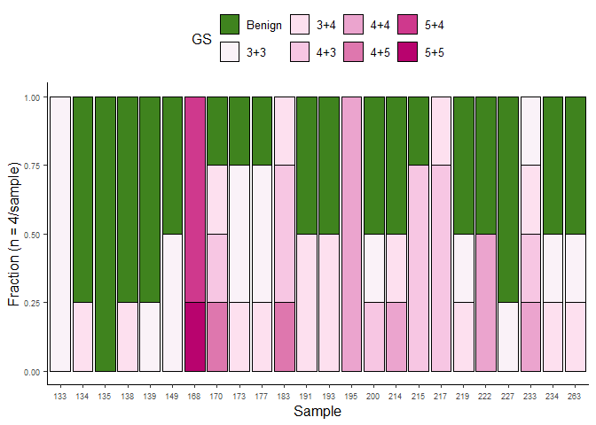<!-- -->

### 1D. Organoid formation

``` r
rate <- data.frame(Success = c("Yes", "Yes", "No", "No"), Core = c("Tumor","Benign", "Tumor", "Benign"),
                   count = c(41, 29, 15, 11))

strip <- strip_themed(background_x = elem_list_rect(fill = color_values(1:16,"piyg")[c(16,2)]), text_x = element_text(color="white"))

ggplot(rate, aes(x=Core, y=count, fill=Success)) + geom_bar(stat = "identity", position = "fill", col="black")+ 
  facet_wrap2(~Core, nrow = 2, scales = "free", strip = strip) + theme_classic2() + scale_fill_manual(values = rev(c("gray", "white"))) +
  geom_text(aes(label=count),position = position_fill(vjust = 0.5)) + theme(legend.position = "top") +
  ylab("Fraction") + theme(axis.text.x = element_blank()) + theme(axis.title.x = element_blank()) +
  guides(fill = guide_legend(title.position = "top", title.hjust = 0.5))
```

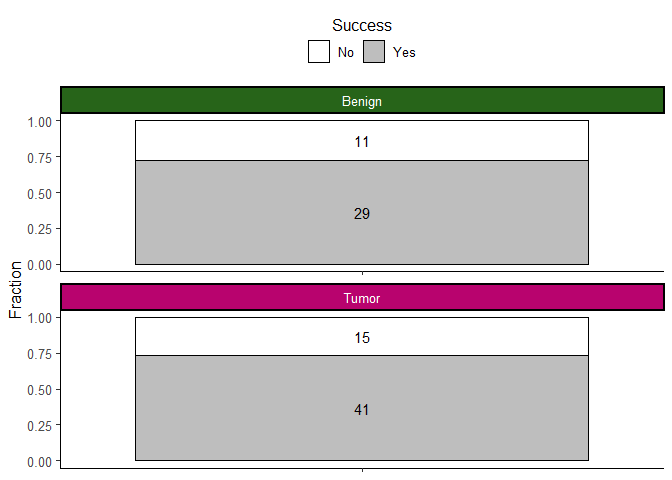<!-- -->

### 1E. Organoid Morphology

``` r
df2 <- cores
df2[,9:11] <- df2[,9:11]/rowSums(df2[,9:11])
df2 <- as.data.frame(df2)
df2 <- melt(as.data.frame(df2), measure.vars = c("Solid", "Hollow", "Mixed"))
ggplot(df2, aes(x=condition, y=value, fill=condition)) + geom_boxplot() + geom_jitter(size=0.5) +
  facet_wrap(~variable) + stat_compare_means(aes(label = paste0("p = ", after_stat(p.format))), hjust=-0.5, size=2) +
  scale_fill_manual(values = color_values(1:11,"piyg")[c(10,2)]) + theme_classic2() +
  ylab("Fraction") + theme(legend.position = "none") +
  theme(axis.text = element_text(size=6)) + theme(axis.title = element_text(size=10)) +theme(axis.title.x = element_blank()) 
```

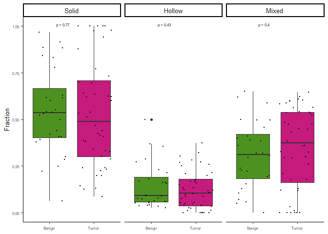<!-- -->

### 1F. Organoid counts

``` r
df2 <- cores
df2 <- as.data.frame(df2)
df2 <- melt(as.data.frame(df2), measure.vars = c("Solid", "Hollow", "Mixed"))
ggplot(df2, aes(x=condition, y=value, fill=condition)) + geom_boxplot() + geom_jitter(size=0.5) +
  stat_compare_means(aes(label = paste0("p = ", after_stat(p.format))), hjust=-0.5, size=2) +
  scale_fill_manual(values = color_values(1:11,"piyg")[c(10,2)]) + theme_classic2() +
  ylab("Total Organoid Count") + theme(legend.position = "none") +
  theme(axis.text = element_text(size=6)) + theme(axis.title = element_text(size=10)) +theme(axis.title.x = element_blank()) 
```

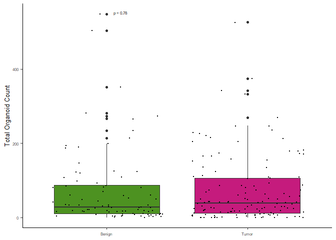<!-- -->

## Sup. Figure 1

### S1A. Patient cohort GS

``` r
clin <- read_xlsx("Clinical.xlsx", sheet = "Sheet1")
clin$GS <- paste0("(", clin$Path_GS1, "+", clin$Path_GS2, ")")
test_samples <- gsub("PCa", "", clin$SAMPLE_NR)
test_samples <- gsub("_P", "", test_samples)
test_samples <- gsub("_", "", test_samples)
clin$sample_new <- test_samples
clin <- filter(clin, sample_new %in% cores$`Lab Code`)
clin$GS_GRP <- "Group 1"
clin$GS <- gsub("\\(", "", clin$GS)
clin$GS <- gsub("\\)", "", clin$GS)
clin$GS_GRP[which(clin$GS %in% c("3+3"))] <- "Group 1"
clin$GS_GRP[which(clin$GS %in% c("3+4"))] <- "Group 2"
clin$GS_GRP[which(clin$GS %in% c("4+3"))] <- "Group 3"
clin$GS_GRP[which(clin$GS %in% c("4+4"))] <- "Group 4"
clin$GS_GRP[which(clin$GS %in% c("4+5","5+4", "5+5"))] <- "Group 5"
clin2 <- melt(table(clin$GS_GRP))
clin2$Var.1 <- factor(clin2$Var.1)

ggplot(clin2[which(clin2$Var.1 != 0),], aes(x=Var.1, y=value, fill=Var.1)) + geom_bar(stat="identity", col="black") +
  theme_classic2() + xlab("GS Group") + scale_fill_manual(values = color_values(16:1,"piyg")[c(9,10,12,14,16)]) +
  geom_text(aes(label=value),position = position_fill(vjust = 0.5), size=2) + ylab("# of Patients") + theme(legend.position = "none")
```

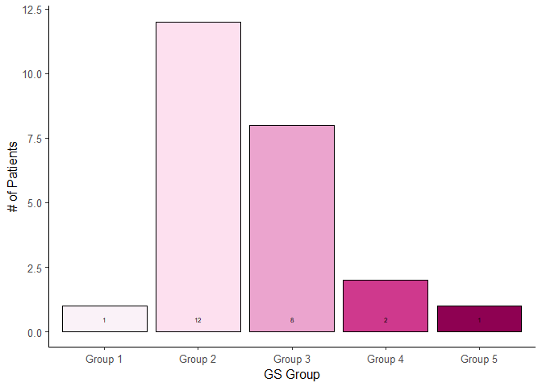<!-- -->

### S1B. Tumor content per core

``` r
cores$`%tumor_content` <- gsub("<","",cores$`%tumor_content`)
cores2 <- filter(cores, `Pathology evaluation` != "normal")
cores2$`%tumor_content` <- as.numeric(cores2$`%tumor_content`)

ggplot(cores2, aes(x=GS_GRP, y=`%tumor_content`, fill=GS_GRP)) + 
  geom_boxplot() + geom_jitter() +ylab("Tumor Content (%)") +
  theme_classic2() + theme(legend.position = "none") +
  xlab("GS") + scale_fill_manual(values = color_values(16:1,"piyg")[c(9,10,12,14,16)]) 
```

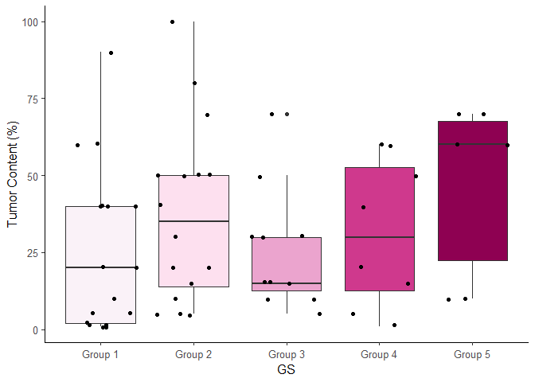<!-- -->

## RNA seq data pre-processing

``` r
my_pal <- c(color_values(1:11,"piyg")[c(10)], "lightgray", color_values(1:11,"piyg")[c(2)])
cores <- read_xlsx("masterfile_GS_TC_allcores.xlsx")
cores$Sample <- paste0(cores$`Lab Code`, cores$Core)
cores$condition <- "Tumor"
cores$condition[which(cores$`Pathology evaluation` == "normal")] <- "Benign"
df <- read.table("Processed.counts.csv", header = T, sep=",", row.names = 1)
df <- df[which(!duplicated(df$gene_name)),]
rownames(df) <- df$gene_name
df <- df[,-1]
colnames(df) <- gsub("PCa_","",colnames(df))
colnames(df) <- gsub("_TS","",colnames(df))
colnames(df) <- gsub("_","",colnames(df))

design <- data.frame(Sample = colnames(df))
design <- cbind.data.frame(design, Patient = substr(design$Sample, 1, 3))
rownames(design) <- design$Sample

design2 <- merge(design, cores, by="Sample")
rownames(design2) <- design2$Sample
design2 <- design2[colnames(df),]

dds <- DESeqDataSetFromMatrix(countData=df, 
                              colData=design2, 
                              design=~condition, tidy = FALSE)

design2 <- design
samples_to_keep <- names(table(design2$Patient))[which(table(design2$Patient) > 1)]
design2 <- filter(design2, Patient %in% samples_to_keep)

df2 <- df[,colnames(df) %in% rownames(design2)]
design2 <- design2[colnames(df2),]


dds <- DESeqDataSetFromMatrix(countData=df2, 
                              colData=design2, 
                              design=~Patient, tidy = FALSE)
dds <- dds[(rowSums(counts(dds) > 3) > 3 ),]
dds <- DESeq(dds)

vsd <- vst(dds)
df_norm <- t(assay(vsd))

rna.pr <- prcomp(df_norm, center = T, scale = TRUE)
pca_df <- data.frame(rna.pr$x[,1:2], Sample = rownames(rna.pr$x[,1:2]))
pca_df <- merge(pca_df, design2, by="Sample")
pca_df <- merge(pca_df, cores, by="Sample")
```

## Sup. Figure 6

### S6A. PCA tumor vs benign

``` r
ggplot(pca_df, aes(x = PC1, y = PC2, col=condition, fill=condition)) + geom_point(size=4, shape=21, col="black") +
  theme_classic2() + theme(legend.position = "top", legend.title = element_blank()) +
  scale_color_manual(values = my_pal[c(1,3)]) +
  scale_fill_manual(values = my_pal[c(1,3)]) +
  ggforce::geom_mark_ellipse(aes(group=condition))
```

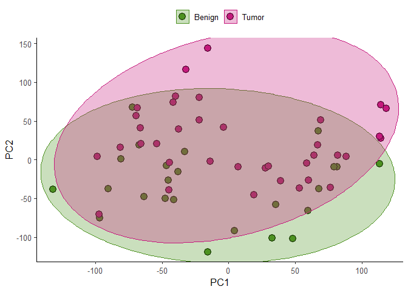<!-- -->

### S6B. DE/Volcano plot tumor vs benign

``` r
design <- data.frame(Sample = colnames(df))
design <- cbind.data.frame(design, Patient = substr(design$Sample, 1, 3))
rownames(design) <- design$Sample

design2 <- merge(design, cores, by="Sample")
rownames(design2) <- design2$Sample
samples_to_keep <- names(table(design2$Patient))[which(table(design2$Patient) > 1)]
design2 <- filter(design2, Patient %in% samples_to_keep)
df2 <- df[,colnames(df) %in% rownames(design2)]
design2 <- design2[colnames(df2),]

dds <- DESeqDataSetFromMatrix(countData=df2, 
                              colData=design2, 
                              design=~condition, tidy = FALSE)
dds <- dds[(rowSums(counts(dds) > 3) > 3 ),]
dds <- DESeq(dds)

res <- results(dds, contrast = c("condition", "Tumor", "Benign"))
res <- as.data.frame(res)
res <- res[order(res$padj, decreasing = F),]
res <- cbind.data.frame(res, Gene_name = rownames(res))
res$log2FoldChange[which(res$log2FoldChange < -7)] <- -7
res$log2FoldChange[which(res$log2FoldChange > 7)] <- 7
res$DE <- "ns"
res$DE[which((res$log2FoldChange < -1)&(res$padj<0.05))] <- "Downregulated"
res$DE[which((res$log2FoldChange > 1)&(res$padj<0.05))] <- "Upregulated"
res <- na.omit(res)
ggplot(res, aes(x=log2FoldChange, y=-log10(padj), col=DE)) + geom_point() + theme_classic2() + 
  geom_vline(xintercept = 1, linetype= "dashed", col="gray") +
  geom_vline(xintercept = -1, linetype= "dashed", col="gray") +
  geom_hline(yintercept = -log10(0.05), linetype= "dashed", col="gray") +
  xlab("log2FoldChange\n(Tumor vs Benign)") + scale_color_manual(values = my_pal) +
  theme(legend.position = "top") + theme(legend.title = element_blank()) +
  annotate("text", x=-5, y=30, label = paste0("(",table(res$DE)[1], ")"), col=my_pal[1])+
  annotate("text", x=5, y=30, label = paste0("(",table(res$DE)[3], ")"), col=my_pal[3]) +
  xlim(-max(abs(res$log2FoldChange)), max(abs(res$log2FoldChange)))
```

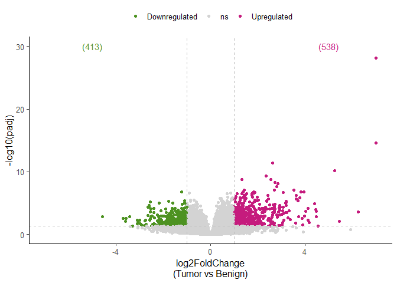<!-- -->

### S6C. Master regulator analysis, tumor vs benign

``` r
net <- get_collectri()
degs <- filter(res, padj < 0.05 & abs(log2FoldChange) > 1)
rownames(degs) <- degs$Gene_name
contrast_acts <- run_viper(degs[,"stat",drop=F], net, minsize = 10)

ggplot(contrast_acts[order(abs(contrast_acts$score), decreasing = T)[1:10],], aes(x = reorder(source, score), y = score)) + 
  geom_bar(aes(fill = score), stat = "identity") +
  scale_fill_gradient2(low = my_pal[1], high = my_pal[3], 
                       mid = my_pal[2], midpoint = 0) + 
  theme_minimal() +
  theme(axis.title = element_text(face = "bold", size = 12),
        axis.text.x = 
          element_text(angle = 45, hjust = 1, size =6, face= "bold"),
        axis.text.y = element_text(size =10, face= "bold"),
        panel.grid.major = element_blank(), 
        panel.grid.minor = element_blank()) +
  xlab("MRs") + theme(legend.position = "none") + ylab("Enrichment Score")
```

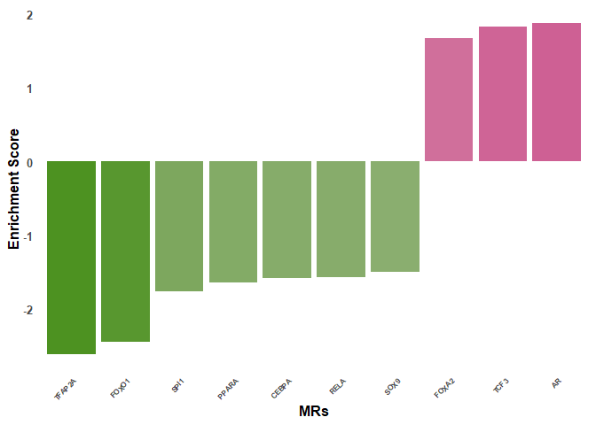<!-- -->

### S6D. PC explained variance

``` r
fviz_eig(rna.pr,
         addlabels = F, 
         barcolor = "black", 
         barfill = carto_pal(9, "Vivid")[9], 
         choice = "variance",ncp = 10) + theme_bw()+
  geom_hline(yintercept = 5, linetype="dashed")
```

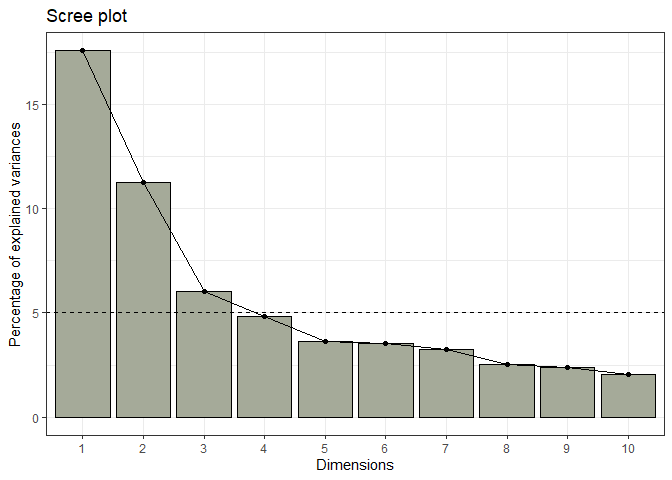<!-- -->

### S6E. Optimal number of clusters

``` r
fviz_nbclust(rna.pr$x[,1:3], kmeans, method = "silhouette", linecolor = "black") +
  labs(subtitle = "Silhouette method")
```

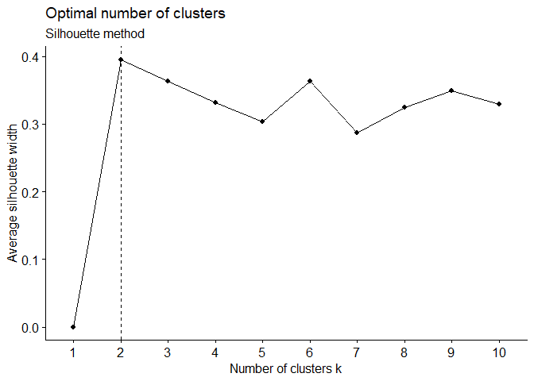<!-- -->

### S6F. Clustering and comparison to patient id

``` r
set.seed(123)
clust <- kmeans(rna.pr$x[,1:3], centers = 2)
clust$cluster <- factor(clust$cluster)
cluster_df <- data.frame(Sample = names(clust$cluster), cluster = clust$cluster)
cluster_df$Patient <- substr(cluster_df$Sample, 1, 3)
cluster_df$cluster <- paste0("C", cluster_df$cluster)
cluster_df_melt <- melt(table(cluster_df$Patient, cluster_df$cluster))
cluster_df_melt$Var.2 <- factor(cluster_df_melt$Var.2)
cluster_df_melt$Var.1 <- factor(cluster_df_melt$Var.1)
colnames(cluster_df_melt) <- c("Patient","Cluster", "value")
ggplot(cluster_df_melt, aes(x=Patient, y=value, fill=Cluster)) + geom_bar(stat="identity", position = "fill") +
  theme_classic2() + scale_fill_manual(values = carto_pal(9, "Vivid")[c(6,7)]) +
  ylab("Fraction") + theme(legend.position = "top") +theme(axis.text.x = element_text(angle=90, vjust = 0.5))
```

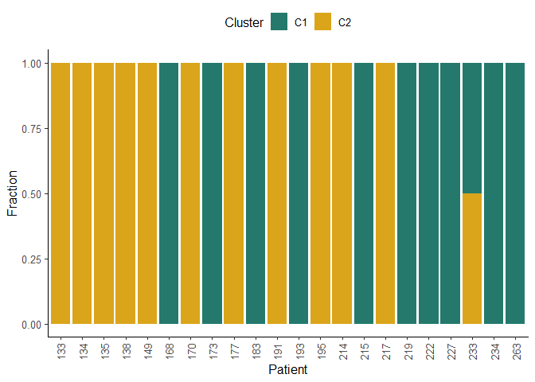<!-- -->

## Figure 4

### 4A. PCA colored by clusters (C1/C2)

``` r
pca_df <- merge(pca_df, cluster_df, by="Sample")
ggplot(pca_df, aes(x = PC1, y = PC2, col=cluster, fill=cluster)) + geom_point(size=4, shape=21, col="black") +
  theme_classic2() + theme(legend.position = "top", legend.title = element_blank()) +
  scale_color_manual(values = carto_pal(9, "Vivid")[c(6,7)],) +
  scale_fill_manual(values = carto_pal(9, "Vivid")[c(6, 7)],) +
  ggforce::geom_mark_ellipse(aes(group=cluster))
```

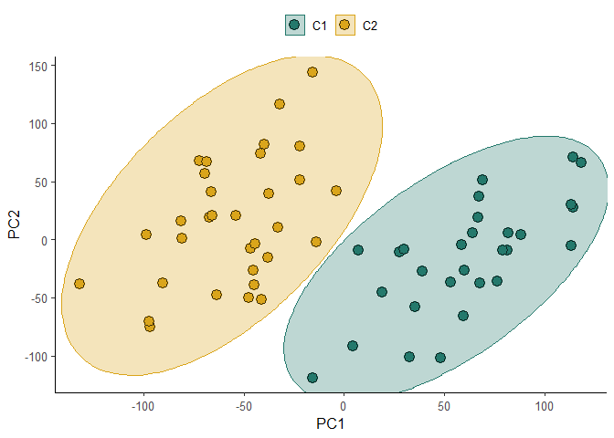<!-- -->

### 4B. PDO drug screen results

``` r
viability <- read.table("PC_organoid_drug_screen FC_viability_alldata_hetscore.txt", header = T, sep = "\t", dec = ",") 
rownames(viability) <- paste0(viability$Patient, viability$Core) 
viability <- viability[,-ncol(viability)] 

for(f in 3:ncol(viability)){
  viability[which(viability[,f] > 1),f] <- 1
  #viability[,f] <- scale(viability[,f])
} 

viability$Sample <- substr(rownames(viability), 1, 4) 
viability[which(viability[,f] > 1),f] <- 1
viability <- melt(viability, id.vars = c("Patient", "Core", "Sample"))
viability$variable <- sapply(strsplit(as.character(viability$variable), split = "\\."), "[", 1)  
ggplot(viability, aes(x=reorder(variable, -value), y=value)) + geom_boxplot(fill=carto_pal(9, "Vivid")[c(9)]) + coord_flip() +
  theme_classic2() + geom_jitter(alpha=0.2) +
  ylab("Viablility") + xlab("Deugs")
```

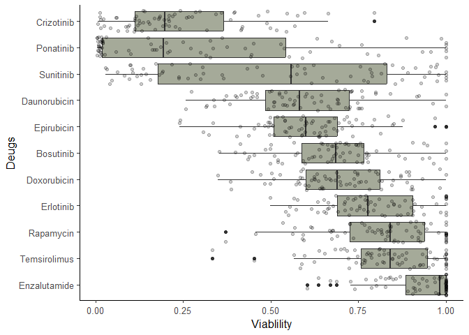<!-- -->

### 4D. PDO drug screen vs clusters (significant results)

``` r
cluster_df2 <- merge(cluster_df, viability, by="Sample")
cluster_df2 <- merge(cluster_df2, cores, by="Sample")
cluster_df3 <- filter(cluster_df2, variable %in% c("Crizotinib", "Daunorubicin", "Ponatinib", "Sunitinib"))
cluster_df3$variable <- factor(cluster_df3$variable, levels = c("Crizotinib", "Ponatinib", "Daunorubicin", "Sunitinib"))
ggplot(cluster_df3, aes(x=cluster, y=value, fill=cluster)) + geom_boxplot() + 
  stat_compare_means(vjust = 1.5,aes(label = paste0("p = ", after_stat(p.format)))) + theme_classic2() +
  geom_jitter(alpha=0.2) + xlab("Clusters") + ylab("Viability") +
  facet_wrap(~variable, scale="free", nrow = 1) +
  scale_fill_manual(values = carto_pal(9, "Vivid")[c(6, 7)]) +
  theme(legend.position = "none")  + ylim(0,1.01) 
```

<!-- -->
