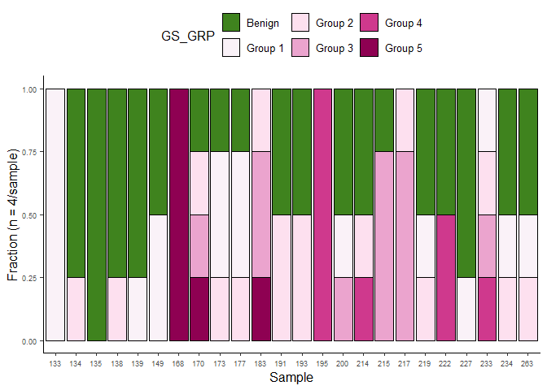

Figures
================
Dr. Panagiotis Chouvardas
2024-12-02

- [Pre-processing](#pre-processing)
  - [Loading libraries](#loading-libraries)
  - [Reading master file](#reading-master-file)
- [Figure 1](#figure-1)
  - [1C. Cohort.](#1c-cohort)
  - [1D. Organoid formation](#1d-organoid-formation)
  - [1E. Organoid Morphology](#1e-organoid-morphology)
  - [1F. Organoid counts](#1f-organoid-counts)
- [Sup. Figure 1](#sup-figure-1)
  - [S1A. Patient cohort GS](#s1a-patient-cohort-gs)
  - [S1B. Tumor content per core](#s1b-tumor-content-per-core)

## Pre-processing

### Loading libraries

``` r
library(ggplot2)
library(pals)
library(factoextra)
library(reshape)
library(ggpubr)
library(matrixStats)
library(tidyverse)
library(decoupleR)
library(rcartocolor)
`%!in%` = Negate(`%in%`)
library(DESeq2)
library(ggrepel)
library(rcartocolor)
library(colourvalues)
library(readxl)
library(ggh4x)
```

### Reading master file

``` r
cores <- read_xlsx("masterfile_GS_TC_allcores.xlsx")
cores$Sample <- paste0(cores$`Lab Code`, cores$Core)
cores$condition <- "Tumor"
cores$condition[which(cores$`Pathology evaluation` == "normal")] <- "Benign"
```

## Figure 1

### 1C. Cohort.

``` r
cores_gs <- melt(table(cores$`Lab Code`, cores$`Pathology evaluation`))
colnames(cores_gs) <- c("Sample", "GS", "count")
cores_gs$Sample <- factor(cores_gs$Sample)
cores_gs$GS <- gsub("normal", "Benign", cores_gs$GS)
cores_gs$GS <- factor(cores_gs$GS, levels = c("Benign", "3+3", "3+4", "4+3", "4+4", "4+5", "5+4", "5+5"))
ggplot(cores_gs, aes(x=Sample, y=count, fill=GS)) + geom_bar(stat="identity", position="fill", col="black") +
  theme_classic2() + 
  scale_fill_manual(values = color_values(16:1,"piyg")[c(2,9:16)]) + 
  #geom_text(aes(label=count),position = position_fill(vjust = 0.5), data = cores_gs[which(cores_gs$count > 0),], size=2) +
  theme(legend.position = "top") + ylab("Fraction (n = 4/sample)") + theme(axis.text = element_text(size = 7)) 
```

<!-- -->

### 1D. Organoid formation

``` r
rate <- data.frame(Success = c("Yes", "Yes", "No", "No"), Core = c("Tumor","Benign", "Tumor", "Benign"),
                   count = c(41, 29, 15, 11))

strip <- strip_themed(background_x = elem_list_rect(fill = color_values(1:16,"piyg")[c(16,2)]), text_x = element_text(color="white"))

ggplot(rate, aes(x=Core, y=count, fill=Success)) + geom_bar(stat = "identity", position = "fill", col="black")+ 
  facet_wrap2(~Core, nrow = 2, scales = "free", strip = strip) + theme_classic2() + scale_fill_manual(values = rev(c("gray", "white"))) +
  geom_text(aes(label=count),position = position_fill(vjust = 0.5)) + theme(legend.position = "top") +
  ylab("Fraction") + theme(axis.text.x = element_blank()) + theme(axis.title.x = element_blank()) +
  guides(fill = guide_legend(title.position = "top", title.hjust = 0.5))
```

<!-- -->

### 1E. Organoid Morphology

``` r
df2 <- cores
df2[,9:11] <- df2[,9:11]/rowSums(df2[,9:11])
df2 <- as.data.frame(df2)
df2 <- melt(as.data.frame(df2), measure.vars = c("Solid", "Hollow", "Mixed"))
ggplot(df2, aes(x=condition, y=value, fill=condition)) + geom_boxplot() + geom_jitter(size=0.5) +
  facet_wrap(~variable) + stat_compare_means(aes(label = paste0("p = ", after_stat(p.format))), hjust=-0.5, size=2) +
  scale_fill_manual(values = color_values(1:11,"piyg")[c(10,2)]) + theme_classic2() +
  ylab("Fraction") + theme(legend.position = "none") +
  theme(axis.text = element_text(size=6)) + theme(axis.title = element_text(size=10)) +theme(axis.title.x = element_blank()) 
```

<!-- -->

### 1F. Organoid counts

``` r
df2 <- cores
df2 <- as.data.frame(df2)
df2 <- melt(as.data.frame(df2), measure.vars = c("Solid", "Hollow", "Mixed"))
ggplot(df2, aes(x=condition, y=value, fill=condition)) + geom_boxplot() + geom_jitter(size=0.5) +
  stat_compare_means(aes(label = paste0("p = ", after_stat(p.format))), hjust=-0.5, size=2) +
  scale_fill_manual(values = color_values(1:11,"piyg")[c(10,2)]) + theme_classic2() +
  ylab("Total Organoid Count") + theme(legend.position = "none") +
  theme(axis.text = element_text(size=6)) + theme(axis.title = element_text(size=10)) +theme(axis.title.x = element_blank()) 
```

<!-- -->

## Sup. Figure 1

### S1A. Patient cohort GS

``` r
clin <- read_xlsx("Clinical.xlsx", sheet = "Sheet1")
clin$GS <- paste0("(", clin$Path_GS1, "+", clin$Path_GS2, ")")
clin2 <- melt(table(clin$GS))
clin2$Var.1 <- factor(clin2$Var.1)
clin2$Var.1 <- gsub("\\(", "", clin2$Var.1)
clin2$Var.1 <- gsub("\\)", "", clin2$Var.1)
ggplot(clin2[which(clin2$Var.1 != 0),], aes(x=Var.1, y=value, fill=Var.1)) + geom_bar(stat="identity", col="black") +
  theme_classic2() + xlab("GS") + scale_fill_manual(values = color_values(8:1,"piyg")[2:8]) +
  geom_text(aes(label=value),position = position_fill(vjust = 0.5), size=2) + ylab("# of Patients") + theme(legend.position = "none")
```

<!-- -->

### S1B. Tumor content per core

``` r
cores$`%tumor_content` <- gsub("<","",cores$`%tumor_content`)
cores2 <- filter(cores, `Pathology evaluation` != "normal")
cores2$`%tumor_content` <- as.numeric(cores2$`%tumor_content`)
ggplot(cores2, aes(x=`Pathology evaluation`, y=`%tumor_content`, fill=`Pathology evaluation`)) + 
  geom_boxplot() + geom_jitter() +ylab("Tumor Content (%)") +
  theme_classic2() + theme(legend.position = "none") +
  xlab("GS") + scale_fill_manual(values = color_values(8:1,"piyg")[2:8]) 
```

<!-- -->
