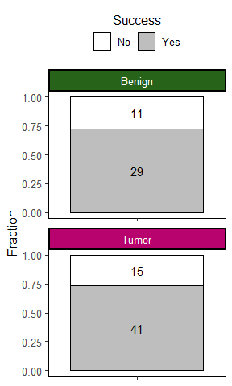
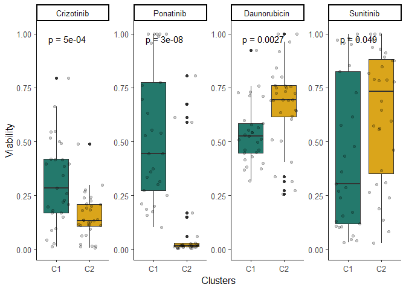

Figures
================
Dr. Panagiotis Chouvardas

- [Pre-processing](#pre-processing)
  - [Loading libraries](#loading-libraries)
  - [Reading master file and creating gleason
    groups](#reading-master-file-and-creating-gleason-groups)
- [Figure 1](#figure-1)
  - [1C. Cohort.](#1c-cohort)
  - [1D. Organoid formation](#1d-organoid-formation)
  - [1E. Organoid Morphology](#1e-organoid-morphology)
  - [1F. Organoid counts](#1f-organoid-counts)
- [Sup. Figure 1](#sup-figure-1)
  - [S1A. Patient cohort GS](#s1a-patient-cohort-gs)
  - [S1B. Tumor content per core](#s1b-tumor-content-per-core)
- [RNA seq data pre-processing](#rna-seq-data-pre-processing)
- [Sup. Figure 6](#sup-figure-6)
  - [S6A. PCA tumor vs benign](#s6a-pca-tumor-vs-benign)
  - [S6B. DE/Volcano plot tumor vs
    benign](#s6b-devolcano-plot-tumor-vs-benign)
  - [S6C. Master regulator analysis, tumor vs
    benign](#s6c-master-regulator-analysis-tumor-vs-benign)
  - [S6D. PC explained variance](#s6d-pc-explained-variance)
  - [S6E. Optimal number of clusters](#s6e-optimal-number-of-clusters)
  - [S6F. Clustering and comparison to patient
    id](#s6f-clustering-and-comparison-to-patient-id)
- [Figure 4](#figure-4)
  - [4A. PCA colored by clusters
    (C1/C2)](#4a-pca-colored-by-clusters-c1c2)
  - [4B. PDO drug screen results](#4b-pdo-drug-screen-results)
  - [4D. PDO drug screen vs clusters (significant
    results)](#4d-pdo-drug-screen-vs-clusters-significant-results)
- [Sup. Figure 8](#sup-figure-8)
  - [S8A. RTK ligands and receptors
    expression](#s8a-rtk-ligands-and-receptors-expression)
  - [S8B. PDO drug screen vs clusters (not significant
    results)](#s8b-pdo-drug-screen-vs-clusters-not-significant-results)
- [Figure 5](#figure-5)
  - [5A. Pathway activity comparison](#5a-pathway-activity-comparison)
  - [5B. Machine learning, cross validation plotting and selection of
    the best
    model](#5b-machine-learning-cross-validation-plotting-and-selection-of-the-best-model)
  - [5C. Testing best model in unseen
    data](#5c-testing-best-model-in-unseen-data)

## Pre-processing

### Loading libraries

``` r
library(ggplot2)
library(pals)
library(factoextra)
library(reshape)
library(ggpubr)
library(matrixStats)
library(tidyverse)
library(decoupleR)
library(rcartocolor)
`%!in%` = Negate(`%in%`)
library(BiocGenerics)
library(DESeq2)
library(ggrepel)
library(rcartocolor)
library(colourvalues)
library(readxl)
library(ggh4x)
library(tidymodels)
```

### Reading master file and creating gleason groups

``` r
cores <- read_xlsx("masterfile_GS_TC_allcores.xlsx")
cores$Sample <- paste0(cores$`Lab Code`, cores$Core)
cores$condition <- "Tumor"
cores$condition[which(cores$`Pathology evaluation` == "normal")] <- "Benign"
cores$GS_GRP <- "Benign"
cores$GS_GRP[which(cores$`Pathology evaluation` %in% c("3+3"))] <- "Group 1"
cores$GS_GRP[which(cores$`Pathology evaluation` %in% c("3+4"))] <- "Group 2"
cores$GS_GRP[which(cores$`Pathology evaluation` %in% c("4+3"))] <- "Group 3"
cores$GS_GRP[which(cores$`Pathology evaluation` %in% c("4+4"))] <- "Group 4"
cores$GS_GRP[which(cores$`Pathology evaluation` %in% c("4+5","5+4", "5+5"))] <- "Group 5"
```

## Figure 1

### 1C. Cohort.

``` r
cores_gs2 <- melt(table(cores$`Lab Code`, cores$GS_GRP))
colnames(cores_gs2) <- c("Sample", "GS_GRP", "count")
cores_gs2$Sample <- factor(cores_gs2$Sample)
ggplot(cores_gs2, aes(x=Sample, y=count, fill=GS_GRP)) + geom_bar(stat="identity", position="fill", col="black") +
  theme_classic2() + 
  scale_fill_manual(values = color_values(16:1,"piyg")[c(2,9,10,12,14,16)]) + 
  theme(legend.position = "top") + ylab("Fraction (n = 4/sample)") + theme(axis.text = element_text(size = 7))  
```

<!-- -->

### 1D. Organoid formation

``` r
rate <- data.frame(Success = c("Yes", "Yes", "No", "No"), Core = c("Tumor","Benign", "Tumor", "Benign"),
                   count = c(41, 29, 15, 11))

strip <- strip_themed(background_x = elem_list_rect(fill = color_values(1:16,"piyg")[c(16,2)]), text_x = element_text(color="white"))

ggplot(rate, aes(x=Core, y=count, fill=Success)) + geom_bar(stat = "identity", position = "fill", col="black")+ 
  facet_wrap2(~Core, nrow = 2, scales = "free", strip = strip) + theme_classic2() + scale_fill_manual(values = rev(c("gray", "white"))) +
  geom_text(aes(label=count),position = position_fill(vjust = 0.5)) + theme(legend.position = "top") +
  ylab("Fraction") + theme(axis.text.x = element_blank()) + theme(axis.title.x = element_blank()) +
  guides(fill = guide_legend(title.position = "top", title.hjust = 0.5))
```

<!-- -->

### 1E. Organoid Morphology

``` r
df2 <- cores
df2[,9:11] <- df2[,9:11]/rowSums(df2[,9:11])
df2 <- as.data.frame(df2)
df2 <- melt(as.data.frame(df2), measure.vars = c("Solid", "Hollow", "Mixed"))
ggplot(df2, aes(x=condition, y=value, fill=condition)) + geom_boxplot() + geom_jitter(size=0.5) +
  facet_wrap(~variable) + stat_compare_means(aes(label = paste0("p = ", after_stat(p.format))), hjust=-0.5, size=2) +
  scale_fill_manual(values = color_values(1:11,"piyg")[c(10,2)]) + theme_classic2() +
  ylab("Fraction") + theme(legend.position = "none") +
  theme(axis.text = element_text(size=6)) + theme(axis.title = element_text(size=10)) +theme(axis.title.x = element_blank()) 
```

<!-- -->

### 1F. Organoid counts

``` r
df2 <- cores
df2 <- as.data.frame(df2)
df2 <- melt(as.data.frame(df2), measure.vars = c("Solid", "Hollow", "Mixed"))
ggplot(df2, aes(x=condition, y=value, fill=condition)) + geom_boxplot() + geom_jitter(size=0.5) +
  stat_compare_means(aes(label = paste0("p = ", after_stat(p.format))), hjust=-0.5, size=2) +
  scale_fill_manual(values = color_values(1:11,"piyg")[c(10,2)]) + theme_classic2() +
  ylab("Total Organoid Count") + theme(legend.position = "none") +
  theme(axis.text = element_text(size=6)) + theme(axis.title = element_text(size=10)) +theme(axis.title.x = element_blank()) 
```

<!-- -->

## Sup. Figure 1

### S1A. Patient cohort GS

``` r
clin <- read_xlsx("Clinical.xlsx", sheet = "Sheet1")
clin$GS <- paste0("(", clin$Path_GS1, "+", clin$Path_GS2, ")")
test_samples <- gsub("PCa", "", clin$SAMPLE_NR)
test_samples <- gsub("_P", "", test_samples)
test_samples <- gsub("_", "", test_samples)
clin$sample_new <- test_samples
clin <- filter(clin, sample_new %in% cores$`Lab Code`)
clin$GS_GRP <- "Group 1"
clin$GS <- gsub("\\(", "", clin$GS)
clin$GS <- gsub("\\)", "", clin$GS)
clin$GS_GRP[which(clin$GS %in% c("3+3"))] <- "Group 1"
clin$GS_GRP[which(clin$GS %in% c("3+4"))] <- "Group 2"
clin$GS_GRP[which(clin$GS %in% c("4+3"))] <- "Group 3"
clin$GS_GRP[which(clin$GS %in% c("4+4"))] <- "Group 4"
clin$GS_GRP[which(clin$GS %in% c("4+5","5+4", "5+5"))] <- "Group 5"
clin2 <- melt(table(clin$GS_GRP))
clin2$Var.1 <- factor(clin2$Var.1)

ggplot(clin2[which(clin2$Var.1 != 0),], aes(x=Var.1, y=value, fill=Var.1)) + geom_bar(stat="identity", col="black") +
  theme_classic2() + xlab("GS Group") + scale_fill_manual(values = color_values(16:1,"piyg")[c(9,10,12,14,16)]) +
  geom_text(aes(label=value),position = position_fill(vjust = 0.5), size=2) + ylab("# of Patients") + theme(legend.position = "none")
```

<!-- -->

### S1B. Tumor content per core

``` r
cores$`%tumor_content` <- gsub("<","",cores$`%tumor_content`)
cores2 <- filter(cores, `Pathology evaluation` != "normal")
cores2$`%tumor_content` <- as.numeric(cores2$`%tumor_content`)

ggplot(cores2, aes(x=GS_GRP, y=`%tumor_content`, fill=GS_GRP)) + 
  geom_boxplot() + geom_jitter() +ylab("Tumor Content (%)") +
  theme_classic2() + theme(legend.position = "none") +
  xlab("GS") + scale_fill_manual(values = color_values(16:1,"piyg")[c(9,10,12,14,16)]) 
```

<!-- -->

## RNA seq data pre-processing

``` r
my_pal <- c(color_values(1:11,"piyg")[c(10)], "lightgray", color_values(1:11,"piyg")[c(2)])
cores <- read_xlsx("masterfile_GS_TC_allcores.xlsx")
cores$Sample <- paste0(cores$`Lab Code`, cores$Core)
cores$condition <- "Tumor"
cores$condition[which(cores$`Pathology evaluation` == "normal")] <- "Benign"
df <- read.table("Processed.counts.csv", header = T, sep=",", row.names = 1)
df <- df[which(!duplicated(df$gene_name)),]
rownames(df) <- df$gene_name
df <- df[,-1]
colnames(df) <- gsub("PCa_","",colnames(df))
colnames(df) <- gsub("_TS","",colnames(df))
colnames(df) <- gsub("_","",colnames(df))

design <- data.frame(Sample = colnames(df))
design <- cbind.data.frame(design, Patient = substr(design$Sample, 1, 3))
rownames(design) <- design$Sample

design2 <- merge(design, cores, by="Sample")
rownames(design2) <- design2$Sample
design2 <- design2[colnames(df),]

dds <- DESeqDataSetFromMatrix(countData=df, 
                              colData=design2, 
                              design=~condition, tidy = FALSE)

design2 <- design
samples_to_keep <- names(table(design2$Patient))[which(table(design2$Patient) > 1)]
design2 <- filter(design2, Patient %in% samples_to_keep)

df2 <- df[,colnames(df) %in% rownames(design2)]
design2 <- design2[colnames(df2),]


dds <- DESeqDataSetFromMatrix(countData=df2, 
                              colData=design2, 
                              design=~Patient, tidy = FALSE)
dds <- dds[(rowSums(counts(dds) > 3) > 3 ),]
dds <- DESeq(dds)

vsd <- vst(dds)
df_norm <- t(assay(vsd))

rna.pr <- prcomp(df_norm, center = T, scale = TRUE)
pca_df <- data.frame(rna.pr$x[,1:2], Sample = rownames(rna.pr$x[,1:2]))
pca_df <- merge(pca_df, design2, by="Sample")
pca_df <- merge(pca_df, cores, by="Sample")
```

## Sup. Figure 6

### S6A. PCA tumor vs benign

``` r
ggplot(pca_df, aes(x = PC1, y = PC2, col=condition, fill=condition)) + geom_point(size=4, shape=21, col="black") +
  theme_classic2() + theme(legend.position = "top", legend.title = element_blank()) +
  scale_color_manual(values = my_pal[c(1,3)]) +
  scale_fill_manual(values = my_pal[c(1,3)]) +
  ggforce::geom_mark_ellipse(aes(group=condition))
```

<!-- -->

### S6B. DE/Volcano plot tumor vs benign

``` r
design <- data.frame(Sample = colnames(df))
design <- cbind.data.frame(design, Patient = substr(design$Sample, 1, 3))
rownames(design) <- design$Sample

design2 <- merge(design, cores, by="Sample")
rownames(design2) <- design2$Sample
samples_to_keep <- names(table(design2$Patient))[which(table(design2$Patient) > 1)]
design2 <- filter(design2, Patient %in% samples_to_keep)
df2 <- df[,colnames(df) %in% rownames(design2)]
design2 <- design2[colnames(df2),]

dds <- DESeqDataSetFromMatrix(countData=df2, 
                              colData=design2, 
                              design=~condition, tidy = FALSE)
dds <- dds[(rowSums(counts(dds) > 3) > 3 ),]
dds <- DESeq(dds)

res <- results(dds, contrast = c("condition", "Tumor", "Benign"))
res <- as.data.frame(res)
res <- res[order(res$padj, decreasing = F),]
res <- cbind.data.frame(res, Gene_name = rownames(res))
res$log2FoldChange[which(res$log2FoldChange < -7)] <- -7
res$log2FoldChange[which(res$log2FoldChange > 7)] <- 7
res$DE <- "ns"
res$DE[which((res$log2FoldChange < -1)&(res$padj<0.05))] <- "Downregulated"
res$DE[which((res$log2FoldChange > 1)&(res$padj<0.05))] <- "Upregulated"
res <- na.omit(res)
ggplot(res, aes(x=log2FoldChange, y=-log10(padj), col=DE)) + geom_point() + theme_classic2() + 
  geom_vline(xintercept = 1, linetype= "dashed", col="gray") +
  geom_vline(xintercept = -1, linetype= "dashed", col="gray") +
  geom_hline(yintercept = -log10(0.05), linetype= "dashed", col="gray") +
  xlab("log2FoldChange\n(Tumor vs Benign)") + scale_color_manual(values = my_pal) +
  theme(legend.position = "top") + theme(legend.title = element_blank()) +
  annotate("text", x=-5, y=30, label = paste0("(",table(res$DE)[1], ")"), col=my_pal[1])+
  annotate("text", x=5, y=30, label = paste0("(",table(res$DE)[3], ")"), col=my_pal[3]) +
  xlim(-max(abs(res$log2FoldChange)), max(abs(res$log2FoldChange)))
```

<!-- -->

### S6C. Master regulator analysis, tumor vs benign

``` r
net <- get_collectri()
degs <- filter(res, padj < 0.05 & abs(log2FoldChange) > 1)
rownames(degs) <- degs$Gene_name
contrast_acts <- run_viper(degs[,"stat",drop=F], net, minsize = 10)

ggplot(contrast_acts[order(abs(contrast_acts$score), decreasing = T)[1:10],], aes(x = reorder(source, score), y = score)) + 
  geom_bar(aes(fill = score), stat = "identity") +
  scale_fill_gradient2(low = my_pal[1], high = my_pal[3], 
                       mid = my_pal[2], midpoint = 0) + 
  theme_minimal() +
  theme(axis.title = element_text(face = "bold", size = 12),
        axis.text.x = 
          element_text(angle = 45, hjust = 1, size =6, face= "bold"),
        axis.text.y = element_text(size =10, face= "bold"),
        panel.grid.major = element_blank(), 
        panel.grid.minor = element_blank()) +
  xlab("MRs") + theme(legend.position = "none") + ylab("Enrichment Score")
```

<!-- -->

### S6D. PC explained variance

``` r
fviz_eig(rna.pr,
         addlabels = F, 
         barcolor = "black", 
         barfill = carto_pal(9, "Vivid")[9], 
         choice = "variance",ncp = 10) + theme_bw()+
  geom_hline(yintercept = 5, linetype="dashed")
```

<!-- -->

### S6E. Optimal number of clusters

``` r
fviz_nbclust(rna.pr$x[,1:3], kmeans, method = "silhouette", linecolor = "black") +
  labs(subtitle = "Silhouette method")
```

<!-- -->

### S6F. Clustering and comparison to patient id

``` r
set.seed(123)
clust <- kmeans(rna.pr$x[,1:3], centers = 2)
clust$cluster <- factor(clust$cluster)
cluster_df <- data.frame(Sample = names(clust$cluster), cluster = clust$cluster)
cluster_df$Patient <- substr(cluster_df$Sample, 1, 3)
cluster_df$cluster <- paste0("C", cluster_df$cluster)
cluster_df_melt <- melt(table(cluster_df$Patient, cluster_df$cluster))
cluster_df_melt$Var.2 <- factor(cluster_df_melt$Var.2)
cluster_df_melt$Var.1 <- factor(cluster_df_melt$Var.1)
colnames(cluster_df_melt) <- c("Patient","Cluster", "value")
ggplot(cluster_df_melt, aes(x=Patient, y=value, fill=Cluster)) + geom_bar(stat="identity", position = "fill") +
  theme_classic2() + scale_fill_manual(values = carto_pal(9, "Vivid")[c(6,7)]) +
  ylab("Fraction") + theme(legend.position = "top") +theme(axis.text.x = element_text(angle=90, vjust = 0.5))
```

<!-- -->

## Figure 4

### 4A. PCA colored by clusters (C1/C2)

``` r
pca_df <- merge(pca_df, cluster_df, by="Sample")
ggplot(pca_df, aes(x = PC1, y = PC2, col=cluster, fill=cluster)) + geom_point(size=4, shape=21, col="black") +
  theme_classic2() + theme(legend.position = "top", legend.title = element_blank()) +
  scale_color_manual(values = carto_pal(9, "Vivid")[c(6,7)],) +
  scale_fill_manual(values = carto_pal(9, "Vivid")[c(6, 7)],) +
  ggforce::geom_mark_ellipse(aes(group=cluster))
```

<!-- -->

### 4B. PDO drug screen results

``` r
viability <- read.table("PC_organoid_drug_screen FC_viability_alldata_hetscore.txt", header = T, sep = "\t", dec = ",") 
rownames(viability) <- paste0(viability$Patient, viability$Core) 
viability <- viability[,-ncol(viability)] 

for(f in 3:ncol(viability)){
  viability[which(viability[,f] > 1),f] <- 1
  #viability[,f] <- scale(viability[,f])
} 

viability$Sample <- substr(rownames(viability), 1, 4) 
viability[which(viability[,f] > 1),f] <- 1
viability <- melt(viability, id.vars = c("Patient", "Core", "Sample"))
viability$variable <- sapply(strsplit(as.character(viability$variable), split = "\\."), "[", 1)  
ggplot(viability, aes(x=reorder(variable, -value), y=value)) + geom_boxplot(fill=carto_pal(9, "Vivid")[c(9)]) + coord_flip() +
  theme_classic2() + geom_jitter(alpha=0.2) +
  ylab("Viablility") + xlab("Deugs")
```

<!-- -->

### 4D. PDO drug screen vs clusters (significant results)

``` r
cluster_df2 <- merge(cluster_df, viability, by="Sample")
cluster_df2 <- merge(cluster_df2, cores, by="Sample")
cluster_df3 <- filter(cluster_df2, variable %in% c("Crizotinib", "Daunorubicin", "Ponatinib", "Sunitinib"))
cluster_df3$variable <- factor(cluster_df3$variable, levels = c("Crizotinib", "Ponatinib", "Daunorubicin", "Sunitinib"))
ggplot(cluster_df3, aes(x=cluster, y=value, fill=cluster)) + geom_boxplot() + 
  stat_compare_means(vjust = 1.5,aes(label = paste0("p = ", after_stat(p.format)))) + theme_classic2() +
  geom_jitter(alpha=0.2) + xlab("Clusters") + ylab("Viability") +
  facet_wrap(~variable, scale="free", nrow = 1) +
  scale_fill_manual(values = carto_pal(9, "Vivid")[c(6, 7)]) +
  theme(legend.position = "none")  + ylim(0,1.01) 
```

<!-- -->

## Sup. Figure 8

### S8A. RTK ligands and receptors expression

``` r
design3 <- merge(design2, cluster_df, by="Sample")
design3$cluster <- factor(design3$cluster)
rownames(design3) <- design3$Sample
df2 <- df[,colnames(df) %in% rownames(design3)]
design3 <- design3[colnames(df2),]

dds <- DESeqDataSetFromMatrix(countData=df2, 
                              colData=design3, 
                              design=~cluster, tidy = FALSE)

dds <- dds[(rowSums(counts(dds) > 3) > 3 ),]
dds <- DESeq(dds)

res <- results(dds, contrast = c("cluster", "C1", "C2"))
res <- as.data.frame(res)
res <- res[order(res$padj, decreasing = F),]
head(res, 50)
```

    ##                  baseMean log2FoldChange      lfcSE     stat        pvalue
    ## SRSF6P2          58.94813       4.040299 0.18771517 21.52356 9.367821e-103
    ## YBX1P10          61.96782       3.523175 0.16394566 21.48989 1.935581e-102
    ## ELF2P4           27.16078       5.913353 0.27882061 21.20845 7.980158e-100
    ## RAP1BL           94.16803       3.341059 0.15850052 21.07917  1.235290e-98
    ## PARP4P2          32.48749       6.163626 0.29497617 20.89534  5.903995e-97
    ## ENSG00000259948  24.37825       5.233078 0.25035830 20.90236  5.096657e-97
    ## HSPD1P1          95.91644       4.494155 0.21639286 20.76850  8.342284e-96
    ## UBE2V1P2         36.95321       4.931585 0.23790448 20.72927  1.886451e-95
    ## ENSG00000215835  90.98929       4.178042 0.21144048 19.75990  6.594155e-87
    ## RPS7P10          26.34040       3.838672 0.19521439 19.66388  4.397964e-86
    ## PHF10P1          39.48565       6.123398 0.31146455 19.66002  4.745854e-86
    ## RPS3AP5          54.05004       4.320996 0.22162926 19.49651  1.175428e-84
    ## HSP90AB2P        34.47172       4.206744 0.21655273 19.42596  4.656114e-84
    ## EEF1A1P19       187.32961       4.323917 0.22331557 19.36236  1.603560e-83
    ## RALGAPA1P1      769.28151       1.200053 0.06307006 19.02730  1.013435e-80
    ## RPL6P19         292.31110       4.242905 0.22326197 19.00416  1.575599e-80
    ## HNRNPCP2        344.16471       2.784527 0.14697243 18.94591  4.772569e-80
    ## HSPA9P1          99.24264       4.716622 0.24896230 18.94513  4.844309e-80
    ## FOXN3P1          25.28257       6.257592 0.33176731 18.86139  2.369159e-79
    ## SRRM1P3          82.90295       6.412031 0.34354421 18.66436  9.653162e-78
    ## COX17P1          33.09801       7.857704 0.42261922 18.59287  3.670035e-77
    ## TPT1P9           61.65561       4.068370 0.21976956 18.51198  1.653054e-76
    ## ENSG00000243071  62.52108       4.698935 0.25519379 18.41320  1.029524e-75
    ## RPS13P2          16.66609       4.951522 0.27093506 18.27568  1.292693e-74
    ## ENSG00000243181  45.33356       4.234576 0.23232829 18.22669  3.169167e-74
    ## AHCTF1P1        215.55574       2.611546 0.14332480 18.22118  3.505446e-74
    ## ENSG00000220695  45.42755       5.803680 0.31902690 18.19182  5.991806e-74
    ## RPL35P2          38.31562       4.751905 0.26160302 18.16456  9.848683e-74
    ## BCLAF1P2        241.76294       3.487275 0.19209214 18.15418  1.189906e-73
    ## ZEB2P1           51.67885       6.033820 0.33403212 18.06359  6.167647e-73
    ## ANXA2P2         157.95974       3.832582 0.21244416 18.04042  9.382592e-73
    ## ENSG00000242299  26.11212       4.007557 0.22317867 17.95672  4.251910e-72
    ## BMPR1AP1         81.05071       3.665108 0.20437352 17.93338  6.472121e-72
    ## ENSG00000218418 401.43475       4.618998 0.25962176 17.79126  8.260252e-71
    ## BRD7P2          114.94232       3.989015 0.22456082 17.76363  1.352035e-70
    ## RPSAP15          33.25070       5.458727 0.30745304 17.75467  1.586059e-70
    ## API5P1           20.46827       3.684834 0.20923390 17.61108  2.025609e-69
    ## HNRNPCP3         16.89756       4.802112 0.27347099 17.55986  5.000079e-69
    ## EEF1A1P8         18.57222       5.682529 0.32364574 17.55787  5.178453e-69
    ## GDI2P2           32.15872       4.339219 0.24728408 17.54750  6.215140e-69
    ## ENSG00000230979  31.09092       5.534636 0.31579603 17.52598  9.075966e-69
    ## PSIP1P1          58.44554       3.992184 0.22796605 17.51219  1.156672e-68
    ## PPIAP31         109.30173       4.712639 0.27017415 17.44297  3.893119e-68
    ## SERBP1P1         83.77352       2.923857 0.16777569 17.42718  5.131807e-68
    ## EIF4BP7         138.37469       2.909371 0.16728247 17.39197  9.492002e-68
    ## FTH1P8          113.45603       4.235706 0.24412914 17.35027  1.963213e-67
    ## KMT2CP4          12.45346       7.345847 0.42442952 17.30758  4.124023e-67
    ## CHCHD2P6         40.01983       4.419001 0.25586044 17.27114  7.759562e-67
    ## CENPCP1          29.14109       3.774741 0.21954582 17.19341  2.975266e-66
    ## ELL2P1          181.77439       4.042713 0.23594643 17.13403  8.272280e-66
    ##                         padj
    ## SRSF6P2         2.380082e-98
    ## YBX1P10         2.458866e-98
    ## ELF2P4          6.758396e-96
    ## RAP1BL          7.846256e-95
    ## PARP4P2         2.500047e-93
    ## ENSG00000259948 2.500047e-93
    ## HSPD1P1         3.027891e-92
    ## UBE2V1P2        5.991133e-92
    ## ENSG00000215835 1.861530e-83
    ## RPS7P10         1.096163e-82
    ## PHF10P1         1.096163e-82
    ## RPS3AP5         2.488676e-81
    ## HSP90AB2P       9.099837e-81
    ## EEF1A1P19       2.910118e-80
    ## RALGAPA1P1      1.716556e-77
    ## RPL6P19         2.501952e-77
    ## HNRNPCP2        6.837741e-77
    ## HSPA9P1         6.837741e-77
    ## FOXN3P1         3.168064e-76
    ## SRRM1P3         1.226289e-74
    ## COX17P1         4.440218e-74
    ## TPT1P9          1.909052e-73
    ## ENSG00000243071 1.137265e-72
    ## RPS13P2         1.368477e-71
    ## ENSG00000243181 3.220761e-71
    ## AHCTF1P1        3.425494e-71
    ## ENSG00000220695 5.638290e-71
    ## RPL35P2         8.936625e-71
    ## BCLAF1P2        1.042481e-70
    ## ZEB2P1          5.223380e-70
    ## ANXA2P2         7.689791e-70
    ## ENSG00000242299 3.375883e-69
    ## BMPR1AP1        4.982945e-69
    ## ENSG00000218418 6.172595e-68
    ## BRD7P2          9.814616e-68
    ## RPSAP15         1.119361e-67
    ## API5P1          1.390936e-66
    ## HNRNPCP3        3.343079e-66
    ## EEF1A1P8        3.373563e-66
    ## GDI2P2          3.947701e-66
    ## ENSG00000230979 5.624221e-66
    ## PSIP1P1         6.997040e-66
    ## PPIAP31         2.300290e-65
    ## SERBP1P1        2.963269e-65
    ## EIF4BP7         5.359184e-65
    ## FTH1P8          1.084334e-64
    ## KMT2CP4         2.229342e-64
    ## CHCHD2P6        4.107233e-64
    ## CENPCP1         1.542706e-63
    ## ELL2P1          4.203476e-63

``` r
res <- cbind.data.frame(res, Gene_name = rownames(res))
res$log2FoldChange[which(res$log2FoldChange < -7)] <- -7
res$log2FoldChange[which(res$log2FoldChange > 7)] <- 7
res$DE <- "ns"
res$DE[which((res$log2FoldChange < -1)&(res$padj<0.01))] <- "Downregulated"
res$DE[which((res$log2FoldChange > 1)&(res$padj<0.01))] <- "Upregulated"
res <- na.omit(res)
my_pal2 <- carto_pal(9, "Vivid")[c(7, 9, 6)]

RTKs <- read.table("Receptors.csv", header = T, sep=",")
res_RTK <- res[RTKs$Approved.symbol,]

RTK_ligands <- read_xlsx("Ligands.xlsx")
res_RTK_l <- res[RTK_ligands$Ligands,]

res_RTK$type="Receptors"
res_RTK_l$type="Ligands"
res_RTK_lr <- rbind(res_RTK, res_RTK_l)
ggplot(res_RTK_lr[which(res_RTK_lr$padj < 0.05),], aes(x = reorder(Gene_name, log2FoldChange), y = log2FoldChange)) + 
  geom_bar(aes(fill = log2FoldChange), stat = "identity") +
  scale_fill_gradient2(low = my_pal2[1], high = my_pal2[3], 
                       mid = my_pal2[2], midpoint = 0) + 
  theme_classic2() +
  theme(axis.title = element_text(face = "bold", size = 12),
        axis.text.x = 
          element_text(angle = 45, hjust = 1, size =8, face= "bold"),
        axis.text.y = element_text(size =10, face= "bold"),
        panel.grid.major = element_blank(), 
        panel.grid.minor = element_blank()) +
  theme(legend.position = "none") + ylab("log2FoldChange (Cluster 1 vs 2)") +
  facet_wrap(~type, nrow = 2, scales = "free") +theme(axis.title.x = element_blank())
```

<!-- -->

### S8B. PDO drug screen vs clusters (not significant results)

``` r
ggplot(cluster_df2[which(cluster_df2$variable %!in% c("Crizotinib", "Daunorubicin", "Ponatinib", "Sunitinib")),], aes(x=cluster, y=value, fill=cluster)) + geom_boxplot() + 
  stat_compare_means(vjust = 1.5,hjust=-1,aes(label = paste0("p = ", after_stat(p.format)))) + theme_classic2() +
  geom_jitter(alpha=0.2) + xlab("Clusters") + ylab("Viability") +
  facet_wrap(~variable, scale="free", ncol = 1) +
  scale_fill_manual(values = carto_pal(9, "Vivid")[c(6, 7)]) +
  theme(legend.position = "none") + ylim(0,1.01)
```

<!-- -->

## Figure 5

### 5A. Pathway activity comparison

``` r
prog <- get_progeny()
colnames(prog)[3] <- "mor"
contrast_acts <- run_viper(t(df_norm), prog, minsize = 5)
contrast_acts <- merge(contrast_acts, cluster_df, by.x="condition", by.y="Sample")
ggplot(contrast_acts[which(contrast_acts$source %in% c("Androgen", "Hypoxia", "NFkB", "p53", "PI3K", "TNFa", "Trail", "WNT")),], 
       aes(x=cluster, y=scale(score, center = 0), fill=cluster)) + geom_boxplot() + 
  stat_compare_means(vjust = 1,aes(label = paste0("p = ", after_stat(p.format)))) + theme_classic2() +
  facet_wrap(~source, scales = "free", nrow = 2) + geom_jitter(alpha=0.2) +
  scale_fill_manual(values = carto_pal(9, "Vivid")[c(6, 7)]) +
  theme(legend.position = "none") +
    ylab("Activity (VIPER)") + xlab("Clusters")
```

<!-- -->

### 5B. Machine learning, cross validation plotting and selection of the best model

``` r
contrast_acts2 <- contrast_acts %>% pivot_wider(id_cols = condition, names_from = source, values_from = score) %>% as.data.frame()
contrast_acts2 <- merge(contrast_acts2, cluster_df, by.x="condition", by.y="Sample")
data <- contrast_acts2
data <- data[,-c(1, ncol(data))]
set.seed(123)
#Put 3/4 of the data into the training set
data_split <- initial_split(data, prop = 3/4, strata = cluster)

#Create df for 2 datasets
train_data <- training(data_split)
test_data <- testing(data_split)


#Feature selection on training dataset
train_data_selected <- train_data
# Define resampling method (cross-validation)
set.seed(345)
train_cv_folds <- vfold_cv(train_data_selected, v = 10, strata = cluster)

#Apply feature selection to the test data
test_data_selected <- test_data


#Create recipe
formula <- as.formula(cluster ~ .)

basic_rec <- recipe(formula, data = train_data)
prep(basic_rec)

#Specify models
log_spec <-
  multinom_reg(penalty = tune(), mixture = 1) %>% 
  set_engine("glmnet") %>%
  set_mode("classification")

rf_spec <- 
  rand_forest( mtry = tune(), min_n = tune(), trees = 100) %>%
  set_engine("ranger", importance = "impurity") %>% # impurity: provide variable importance scores for this model
  set_mode("classification")

xgb_spec <- 
  boost_tree(trees = 1000, tree_depth = tune(), learn_rate = tune()) %>%
  set_engine("xgboost") %>%
  set_mode("classification") 

knn_spec <- 
  nearest_neighbor(neighbors = tune()) %>% 
  set_engine("kknn") %>%
  set_mode("classification") 

svm_spec <-
  svm_rbf(cost = tune(), rbf_sigma = tune()) %>%
  set_mode("classification") %>%
  set_engine("kernlab", maxiter = 10000, tol = 1e-5)

all_workflows <- 
  workflow_set( preproc = list("basic" = basic_rec),
                models = list(logistic = log_spec, random_forest = rf_spec,
                              xgboost = xgb_spec, knn = knn_spec,
                              svm = svm_spec))
#Tuning
#Define grid
log_grid <- grid_regular(
  penalty(), # Penalty (lambda) on log10 scale ,# Mixture (alpha) from 0 (ridge) to 1 (lasso)
  levels = 50  # Number of levels for each parameter
)


num_predictors <- ncol(train_data) - 1 #subtract sample, value and responder

rf_grid <- grid_regular(
  mtry(range = c(1, num_predictors)),   
  min_n(range = c(1, 10)), # min_n between 1 and 10
  levels = 5              # 5 levels for each parameter
)

xgb_grid <- grid_regular(
  tree_depth(range = c(1, 10)),
  learn_rate(range = c(-3, -1)), # log scale for learning rate
  levels = 5
)

knn_grid <- grid_regular(
  neighbors(range = c(1, 20)),
  levels = 10
)

svm_grid <- grid_regular(
  cost(range = c(-5, 2)), # log scale for cost
  rbf_sigma(range = c(-3, 0)), # log scale for sigma
  levels = 5
)


#Tune 
all_workflows <- all_workflows %>%
  option_add(id="basic_logistic", resamples = train_cv_folds,
             grid = log_grid) %>%
  option_add(id="basic_random_forest", resamples = train_cv_folds, 
             grid = rf_grid) %>%
  option_add(id="basic_xgboost", resamples = train_cv_folds, 
             grid = xgb_grid) %>%
  option_add(id="basic_knn", resamples = train_cv_folds, 
             grid = knn_grid) %>%
  option_add(id="basic_svm", resamples = train_cv_folds, 
             grid = svm_grid)

doParallel::registerDoParallel()  
all_results <- all_workflows %>%
  workflow_map(fn = "tune_grid" , resamples = train_cv_folds, 
               verbose = TRUE)


# Check results
roc_results <- rank_results(all_results, rank_metric = "roc_auc")

raw_roc_auc_plot <- autoplot(all_results, metric = "roc_auc") 
#raw_roc_auc_plot + theme_bw() + scale_color_manual(values = pals::kelly()[c(3,4,5,6,8,9)]) +
#  guides(
#    shape = "none") + theme(legend.position = "top") +guides(color=guide_legend(nrow=3,byrow=TRUE))


best_roc_auc_plot <- autoplot(
  all_results,
  rank_metric = "roc_auc",  # <- how to order models
  metric = "roc_auc",       # <- which metric to visualize
  select_best = TRUE     # <- one point per workflow
) +
  lims(y = c(0.5, 1)) +
  theme(
    axis.title = element_text(size = 18),   # Increase axis title size
    axis.text = element_text(size = 14),       # Increase legend text size
    legend.title = element_text(size = 14),
    legend.text = element_text(size = 14))
#best_roc_auc_plot + theme_bw() + scale_color_manual(values = pals::kelly()[c(3,4,5,6,8,9)]) +
#  guides(
#    shape = "none") + theme(legend.position = "top") +guides(color=guide_legend(nrow=3,byrow=TRUE))

raw_accuracy_plot <- autoplot(all_results, metric = "accuracy", select_best = T, std_errs = 1) 
raw_accuracy_plot + theme_bw() + scale_color_manual(values = pals::kelly()[c(3,7,4,5,6,9)]) +
  guides(
    shape = "none") + theme(legend.position = "top") +guides(color=guide_legend(nrow=3,byrow=TRUE)) +
  ylim(0.5,1) 
```

<!-- -->

``` r
# Get all workflow IDs
workflow_ids <- all_results %>% pull(wflow_id)

# Loop through all workflows to get the best result based on ROC AUC
best_results_list <- lapply(workflow_ids, function(id) {
  # Extract results for the current workflow ID
  result <- extract_workflow_set_result(all_results, id = id)
  # Get the best result based on ROC AUC
  best_result <- show_best(result, metric = "roc_auc", n = 1)
  # Add workflow_id to the result
  best_result$workflow_id <- id
  return(best_result)
})

# Combine all best results into a single data frame
best_results_df <- bind_rows(best_results_list)

best_model_info <- head(roc_results, 1)

best_model <- all_results %>%
  extract_workflow_set_result(best_model_info$wflow_id) %>%
  select_best(metric = "roc_auc")

# Finalize the model 
final_wflow <- all_results %>%
  extract_workflow(best_model_info$wflow_id) %>% 
  finalize_workflow(best_model)
```

### 5C. Testing best model in unseen data

``` r
final_fit <- fit(final_wflow, data = train_data_selected)

test_results <- predict(final_fit, new_data = test_data_selected, type = "class") %>%
  bind_cols(test_data_selected)

test_results_prob <- predict(final_fit, new_data = test_data_selected, type = "prob") %>%
  bind_cols(test_data_selected)

# Collect predictions and make confusion matrix
test_results <- test_results %>%
  mutate(
    cluster = as.factor(cluster),
    .pred_class = as.factor(.pred_class)
  )

# Calculate ROC AUC
test_results_prob <- test_results_prob %>%
  mutate(
    cluster = as.factor(cluster))

roc_auc_metric_validation <- test_results_prob %>%
  roc_auc(truth = cluster, .pred_C1)

classification_metrics <- test_results %>%
  metrics(truth = cluster, estimate = .pred_class)

conf_matrix <- test_results %>% 
  conf_mat(truth = cluster, estimate = .pred_class)

#Final visualization and plots ------------------
# Convert confusion matrix to a tidy format
conf_matrix_tidy <- as.data.frame(conf_matrix$table)

# Extract classification metrics (e.g., accuracy, precision, recall, etc.)
accuracy <- classification_metrics %>%
  filter(.metric == "accuracy") %>%
  pull(.estimate)

kap <- classification_metrics %>%
  filter(.metric == "kap") %>%
  pull(.estimate)


roc_auc <- roc_auc_metric_validation %>%
  pull(.estimate)

conf_matrix_heatmap <- ggplot(conf_matrix_tidy, aes(x = Prediction, y = Truth, fill = Freq)) +
  geom_tile() +
  geom_text(aes(label = Freq), color = "white", size = 5) +
  scale_fill_gradientn(colours = rev(pals::ocean.ice(11)[3:11])) +
  labs(
    title = paste0("Confusion Matrix Heatmap"),
    x = "Predicted",
    y = "Actual",
    subtitle = paste0("ROC AUC: ", round(roc_auc, 3), 
                      "\nAccuracy: ", round(accuracy, 3),
                      "\nKap: ", round(kap, 3))
  ) + theme_minimal() +
  theme(axis.title = element_text(size = 16),   # Increase axis title size
        axis.text = element_text(size = 14),
        plot.title = element_text(size = 16, face = "bold"),
        plot.subtitle = element_text(size = 16) )

conf_matrix_heatmap
```

<!-- -->
